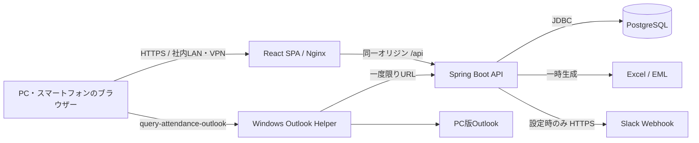
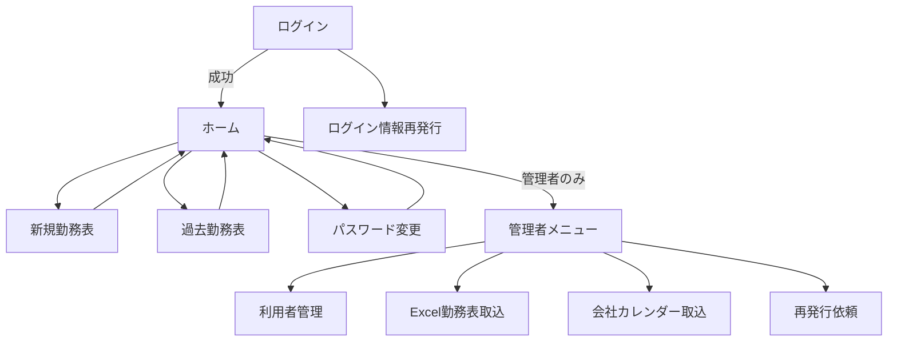
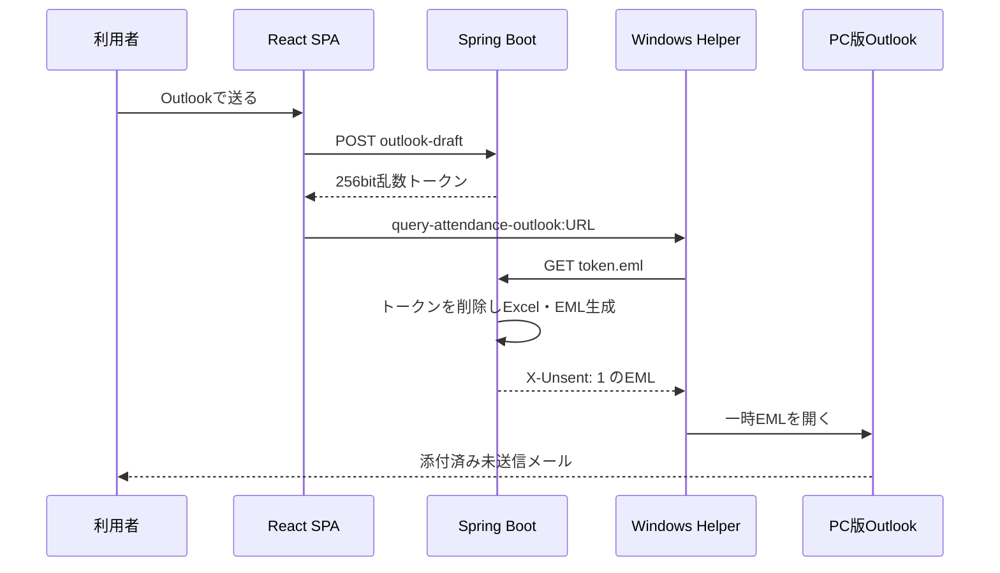

# 勤怠管理システム システム設計書

## 1. 設計方針

本設計は `02-requirements-draft.md` の確定要件を、現在のソースコードとローカル実行環境へ対応付けたものである。現行版は提供済みの正社員・8時間勤務Excelを基準とする。

設計上の優先順位は次のとおり。

1. 本人以外の個人情報・勤怠情報を参照させない。
2. Excel利用者が迷わない勤務表レイアウトと計算結果を維持する。
3. 社内サーバーで無償かつ再現可能に運用する。
4. ファイル本体、パスワード、連携秘密情報を不要に保存しない。
5. 管理者操作と代理操作を追跡可能にする。

## 2. システム構成

### 2.1 技術構成

| 層 | 技術 | 役割 |
|---|---|---|
| フロントエンド | React 19、TypeScript、Vite | SPA、入力検証、画面遷移、レスポンシブ表示 |
| Web配信 | Nginx | 静的ファイル配信、`/api` のバックエンド転送 |
| バックエンド | Java 21、Spring Boot 4.1 | 認証、認可、業務ロジック、ファイル生成、監査 |
| データベース | PostgreSQL 17 | 利用者、社員、勤務表、取込履歴、監査ログ |
| DB移行 | Flyway | スキーマ変更の順序管理 |
| Excel | Apache POI | `.xlsx` 生成、`.xlsx` / `.xlsm` 解析 |
| PDF | Apache PDFBox | 会社カレンダーの文字・日付抽出 |
| 実行基盤 | Docker Compose | DB、Backend、Frontendのローカル・社内サーバー実行 |

### 2.2 配置

- ローカル確認は `http://localhost:4173` を使用する。
- 同一LANのスマートフォン確認は `http://PCのIPv4アドレス:4173` を使用する。
- 本番は社内サーバーまたはVPN内へ配置し、TLSを終端するリバースプロキシを前段に置く。
- 本番で `SESSION_COOKIE_SECURE=true` を設定する。
- DBポートとBackendポートは外部へ公開せず、Frontendだけを利用者向けに公開する。

## 3. フロントエンド設計

### 3.1 画面構成

| 画面 | 利用者 | 主な機能 |
|---|---|---|
| ログイン | 未認証 | 入力検証、認証、再発行画面への遷移 |
| ログイン情報再発行 | 未認証 | 社員コード・氏名による依頼登録、Slack問い合わせ案内 |
| ホーム | 全利用者 | 挨拶、新規作成、過去参照・編集 |
| パスワード変更 | 全利用者 | 本人パスワード変更、初回・期限切れ時の強制変更 |
| 新規勤務表 | 全利用者 | 対象月移動、初期化、入力、一括保存、印刷。役職者・管理者は社員選択による代理操作 |
| 過去勤務表 | 全利用者 | 登録済み月選択、編集、一括保存、本人勤務表の論理削除、印刷。管理者は他社員分も削除可能 |
| 管理者メニュー | 管理者 | 管理機能の選択 |
| 利用者管理 | 管理者 | 検索、作成、有効・無効、仮パスワード再発行 |
| Excel勤務表取込 | 管理者 | 取込先社員、Excel、解除パスワード、上書き確認 |
| 会社カレンダーの取込 | 管理者 | PDFアップロード、抽出結果登録 |
| ログイン情報再発行 | 管理者 | 依頼一覧、対応状態更新 |

### 3.2 画面遷移

- Reactの状態で画面を切り替えるSPAとする。
- 認証セッション取得後、`mustChangePassword` または `passwordExpired` の場合はパスワード変更画面を優先表示する。
- 役職者向け社員選択はUI表示条件だけに依存せず、バックエンドでも `ROLE_MANAGER` または `ROLE_ADMIN` を検証する。
- 管理者メニューと他社員勤務表の削除は、バックエンドでも `ROLE_ADMIN` を検証する。

### 3.3 レイアウト

- ヘッダー左にクエリロゴとシステム名、右にログイン中利用者の氏名と所属部署だけを配置する。
- 業務メニューはメインコンテンツ左側に縦配置する。
- 勤務表はExcelの列構成を維持し、表の横幅が端末を超える場合は勤務表領域だけを横スクロールさせる。
- スマートフォンではメニューと管理画面を1列化し、タップ可能領域を確保する。
- 役職者・管理者画面はロイヤルブルー系、一般画面は黒系グラデーションを背景に使用する。
- 他社員を選ぶプルダウンの表示名は「社員選択」とする。

### 3.4 入力検証

- ログイン、パスワード変更、利用者作成、削除確認は送信前にフロントエンドで検証する。
- サーバーはフロントエンドの結果を信用せず、Jakarta Validationと業務サービスで再検証する。
- 勤務表の必須エラーは対象セルへ保持し、薄いピンク色と入力欄内メッセージで示す。
- 時刻入力は4桁または時刻形式を正規化し、サーバーへは `HH:mm` 形式で送る。

## 4. バックエンド設計

### 4.1 レイヤー

| 種別 | 主なクラス | 責務 |
|---|---|---|
| Controller | `AuthController`、`TimesheetController`、`AdminTimesheetController` 等 | HTTP入出力、入力検証、Principal取得 |
| Service | `TimesheetService`、`TimesheetDeletionService`、`ExcelTimesheetImportService` 等 | 認可を含む業務処理、トランザクション |
| Repository | `EmployeeRepository`、`TimesheetRepository` 等 | パラメータ化SQLによるDBアクセス |
| Calculation | `WorkTimeCalculator`、`MonthlyAggregator` | 日次・月次計算 |
| Export/Import | `TimesheetExportService`、`ExcelTimesheetParser`、`OutlookDraftService` | Excel・EML生成、Excel解析 |

### 4.2 主要API

| メソッド・パス | 権限 | 用途 |
|---|---|---|
| `GET /api/auth/session` | 公開 | 認証状態、権限、CSRF、パスワード期限情報 |
| `POST /api/auth/login` | 公開 | ログイン |
| `POST /api/auth/logout` | 認証済み | ログアウト |
| `PUT /api/auth/password` | 認証済み | 本人パスワード変更 |
| `POST /api/auth/credential-recovery` | 公開 | 再発行依頼 |
| `GET /api/me` | 認証済み | 本人社員情報 |
| `GET /api/timesheets/history` | 認証済み | 本人の登録済み月 |
| `GET /api/timesheets/{year}/{month}` | 認証済み | 本人勤務表 |
| `POST /api/timesheets/{year}/{month}/initialize` | 認証済み | 本人勤務表初期化 |
| `PUT /api/timesheets/{year}/{month}/entries/{date}` | 認証済み | 本人日次更新 |
| `PUT /api/timesheets/{year}/{month}/wg-participation` | 認証済み | WG更新 |
| `DELETE /api/timesheets/{year}/{month}` | 認証済み | 本人勤務表論理削除 |
| `GET /api/timesheets/{year}/{month}/export.xlsx` | 認証済み | 本人勤務表Excel生成 |
| `/api/management/employees` | 役職者・管理者 | 代理操作に必要な有効社員の一覧 |
| `/api/management/employees/{username}/timesheets/**` | 役職者・管理者 | 他社員の参照、初期化、更新。削除だけは管理者 |
| `/api/admin/employees/**` | 管理者 | 利用者検索・作成・状態変更・パスワード再設定 |
| `POST /api/admin/excel-timesheets/{username}` | 管理者 | 指定社員へのExcel取込 |
| `POST /api/admin/company-calendar` | 管理者 | 会社カレンダーPDF取込 |
| `GET /api/admin/credential-recovery` | 管理者 | 再発行依頼一覧 |
| `POST /api/timesheets/{year}/{month}/outlook-draft` | 認証済み | 一度限りのOutlook下書きトークン発行 |
| `GET /api/outlook-drafts/{token}.eml` | トークン | EMLを一度だけ取得 |
| `GET /api/integrations/status` | 認証済み | Slack等の設定状態 |
| `POST /api/integrations/slack` | 認証済み | Slack連絡 |

`POST /api/excel-timesheets` は互換用の本人取込エンドポイントがソース上に残るが、セキュリティ設定で管理者権限を要求し、現行UIからは使用しない。将来整理する際も管理者限定要件を維持する。

### 4.3 エラー応答

- 認証なしは401、権限不足は403、入力不正は400、存在しない対象は404、競合は409を基本とする。
- エラー本文は `{ "message": "日本語メッセージ" }` を基本形とする。
- 本番応答へスタックトレース、SQL、内部パスを含めない。
- 認証失敗はアカウント存在有無を区別しない。

## 5. 認証・認可設計

### 5.1 認証

- Spring Securityのフォームログインとサーバーセッションを使用する。
- パスワードは `BCryptPasswordEncoder(12)` で保存する。
- ログイン成功時にセッション固定攻撃対策としてセッションIDを更新する。
- セッションCookie名は `ATTENDANCE_SESSION` とし、HttpOnly、SameSite=Strictを設定する。
- サーバーセッションタイムアウトは30分、同一ユーザーの最大セッション数は1とする。

### 5.2 パスワードライフサイクル

- `must_change_password` で仮パスワード状態を管理する。
- `password_changed_at` から1か月後を期限とする。
- 期限10日前から残日数をセッションAPIで返し、ログイン後に通知する。
- 期限切れまたは初回変更前は、`MustChangePasswordFilter` が業務APIへのアクセスを拒否する。
- システムが利用者へ知らせずパスワードを変更する方式は採用しない。

### 5.3 ロック

- ログイン失敗回数を `failed_login_count` へ保存する。
- 5回失敗時に `locked_until` を15分後へ設定する。
- ロック中はSpring Securityのユーザー照会で無効として扱う。

### 5.4 認可

- `/api/admin/**` とExcel取込APIは `ROLE_ADMIN` を必須とする。
- 一般勤務表APIはPrincipalのユーザー名を対象社員として固定する。
- 役職者・管理者の代理勤務表APIはパスの対象ユーザーとPrincipalの操作者を別引数でサービスへ渡す。
- 権限は `ROLE_USER`、`ROLE_MANAGER`、`ROLE_ADMIN` の3段階とし、上位権限は下位権限を含む。
- 代理操作は監査ログへ記録する。

### 5.5 Webセキュリティ

- CSRFトークンをSameSite Cookieと `X-XSRF-TOKEN` ヘッダーで検証する。
- CSPは同一オリジンを基本とし、外部スクリプト・オブジェクト・フレームを禁止する。
- `X-Frame-Options: DENY`、HSTS、No Referrer、Permissions-Policyを設定する。
- SQLはJdbcClientの名前付きパラメータで実行する。

## 6. データ設計

### 6.1 主要テーブル

| テーブル | 主キー・一意条件 | 用途 |
|---|---|---|
| `users` | `username` | パスワード、利用可否、失敗回数、ロック、期限管理 |
| `authorities` | `username + authority` | `ROLE_USER`、`ROLE_ADMIN` |
| `employees` | `id`、`username`、`employee_code` | 社員マスターと標準勤務条件 |
| `company_holidays` | `work_date` | 祝日・会社休日 |
| `timesheets` | `id`、社員・年月の有効行一意 | 月次勤務表、WG、Pマーク、所定条件 |
| `daily_entries` | `id`、勤務表・日付一意 | 日次入力と計算結果 |
| `audit_logs` | `id` | 操作者、操作、対象、詳細、発生日時 |
| `company_calendar_imports` | `id` | PDF取込メタデータ |
| `excel_timesheet_imports` | `id` | Excel取込メタデータ |
| `credential_recovery_requests` | `id`、社員ごとの未解決1件 | 再発行依頼 |

### 6.2 論理削除

- `timesheets.deleted_at` と `deleted_by` で論理削除する。
- 有効な社員・年月だけに部分一意インデックスを設定する。
- 通常の履歴・取得処理は削除済み行を除外する。
- 削除後は同じ社員・年月で再作成できる。

### 6.3 更新バージョン

- `timesheets.version` と `daily_entries.version` を保持する。
- 現行実装は更新のたびにバージョンを加算するが、クライアントが読込時のバージョンを送信して比較する競合検知は行っていない。
- 同一勤務表の同時編集を許容する運用へ拡大する場合は、更新APIへ期待バージョンを追加し、条件付き更新が0件なら409として再読込を促す。

### 6.4 ファイル保存方針

- 取込Excel、解除パスワード、会社カレンダーPDFはDBへ保存しない。
- Excel・PDF取込はファイル名、SHA-256、容量、対象、取込者等のメタデータだけを保存する。
- 勤務表ExcelとOutlook EMLは要求時に生成し、恒久保存しない。

## 7. 勤務表業務ロジック

### 7.1 初期化

1. 対象社員と対象年月を検証する。
2. 既存の有効勤務表がある場合、`overwrite=false` なら競合として拒否する。
3. 西暦カレンダーから月初から月末までの日次行を生成する。
4. 土曜、日曜、祝日、会社休日を判定する。
5. 平日へ標準始業・終業、休憩、標準システムNo.を設定する。
6. 翌月最初の営業日をPマーク運用確認日とする。
7. 月次・日次行を同一トランザクションで保存し、監査記録する。

### 7.2 日次計算

- 始業分: 15分単位で切り上げ
- 終業分: 15分単位で切り捨て
- 休憩分: 15分単位で切り上げ
- 労働時間: 終業－始業－休憩
- 日跨ぎ: 終業が始業より前なら24時間加算
- 日曜勤務: 休日労働時間へ計上
- 警告: 始業が10:00より後、終業が16:00より前

計算の単位は分とし、表示時に `H:mm` へ変換する。

### 7.3 月次集計

- 平日労働時間、休日労働時間
- 半休回数
- 所定日数、所定時間
- 所定時間との差分
- システムNo.別の日数・時間

案件集計はExcelの表示枠5件に制限せず、存在するシステムNo.をすべて集計する。

## 8. Excel取込・出力設計

### 8.1 取込

1. 管理者権限と取込先社員を検証する。
2. 拡張子、容量、解除パスワードを検証する。
3. 提供済み「勤務表」シートの固定配置から対象年月と日次値を解析する。
4. Excel記載の氏名・コードと取込先を比較し、差異を警告する。
5. 同月勤務表がある場合は明示的な上書き指定を要求する。
6. 勤務表と取込メタデータをトランザクションで保存する。
7. ファイル本体と解除パスワードは破棄する。

### 8.2 出力

- 保存済み勤務表からApache POIで `.xlsx` を生成する。
- ファイル名は `勤務表_社員コード_YYYY-MM.xlsx` とする。
- 勤務表本体、社員情報、Pマーク、WG、日次値、月次集計を出力する。
- エクスポート操作を監査記録する。

## 9. 会社カレンダーPDF設計

1. 管理者権限、PDF形式、10MB以下、50ページ以下を検証する。
2. PDFBoxで文字を抽出する。
3. 日付と休日・休暇等の名称が組みになった行を抽出する。
4. 抽出日が1件もない画像PDF等は拒否する。
5. `company_calendar_imports` と `company_holidays` を保存する。
6. 取込後に新規作成または確認付き再初期化する勤務表へ反映する。

## 10. Outlook連携設計

### 10.1 処理フロー

### 10.2 セキュリティ

- トークンはSecureRandomの32バイト値をURL-safe Base64へ変換する。
- 有効期限は2分、一度取得した時点で削除する。
- EMLダウンロードはトークンを認証情報として扱い、キャッシュを禁止する。
- Windows HelperはHTTP、ループバック、ポート4173、所定パス、`.eml` の条件を満たすURLだけを受け付ける。
- EMLは `X-Unsent: 1` とし、宛先を自動確定せず利用者が確認する。
- 件名・本文テンプレートへ対象年月と社員名を差し込む。

## 11. Slack連携設計

- Webhook URLは環境変数だけで受け取り、DBや画面へ表示しない。
- URLはHTTPSかつSlack公式Webhookホスト・パスであることを検証する。
- 設定済みの場合は社員名、対象年月、任意メッセージを投稿する。
- 未設定の場合はSlack画面を開き、アプリ上に未設定と表示する。
- 投稿操作は監査ログへ記録する。

## 12. 監査・ログ設計

### 12.1 監査対象

- 勤務表初期化、日次更新、WG更新、論理削除
- 管理者の代理参照・更新
- 利用者作成、有効・無効、仮パスワード再発行
- パスワード変更
- Excel・PDF取込
- Excelエクスポート、Outlook・Slack連携
- ログイン情報再発行対応

### 12.2 記録しない情報

- パスワードと仮パスワード
- Excel解除パスワード
- セッションID、CSRFトークン、Outlook一度限りトークン
- Slack Webhook URL、Microsoftクライアントシークレット
- ファイル本体

## 13. 運用・障害対応

- `docker compose up -d --build` で起動し、DBとBackendのヘルスチェック完了後にFrontendを提供する。
- DBスキーマ変更は既存マイグレーションを編集せず、新しいFlywayファイルを追加する。
- 本番バックアップは日次で取得し、定期的に別環境へ復元して確認する。
- ログ、バックアップ、環境変数ファイルのアクセス権を制限する。
- 障害時に初期管理者パスワードを再投入して既存パスワードを上書きしない。管理者画面または管理された復旧手順を使用する。

## 14. 現時点の制約と今後の設計対象

- 電子承認、提出、差戻し、月次締めの状態モデルは未定義。
- 1日複数案件の配賦UIと明細テーブルは未実装。
- 正社員・8時間勤務以外は帳票と休暇ルールの確認が必要。
- 監査ログ閲覧画面、祝日・システムNo.マスター画面は追加候補。
- SSO、パスキー、VPN、TLS終端、バックアップ監視は社内基盤確定後に設計を確定する。外出先アクセス時のMFAはVPNまたは将来の社内ID基盤の少なくとも一方で必須とする。
- 現行APIには読込バージョンを用いた同時更新競合の検知がないため、複数端末・管理者による同時編集へ運用を拡大する前に実装する。
- Outlookの外部プロトコル起動は通常のEdgeまたはChromeを前提とし、外部アプリ起動を禁止する埋込みブラウザーでは動作しない。

## 15. テスト方針

- Javaの単体テストで計算、認証ライフサイクル、削除、Excel出力、Outlook EMLを検証する。
- FrontendはLintとTypeScriptビルドを必須とする。
- Docker環境でログイン、主要API、画面、DB永続化を確認する。
- `outputs/20260724_acceptance_test_spec/勤怠管理システム_受入テスト仕様書_v1.0.xlsx` を利用者受入テストの記録原本とする。
