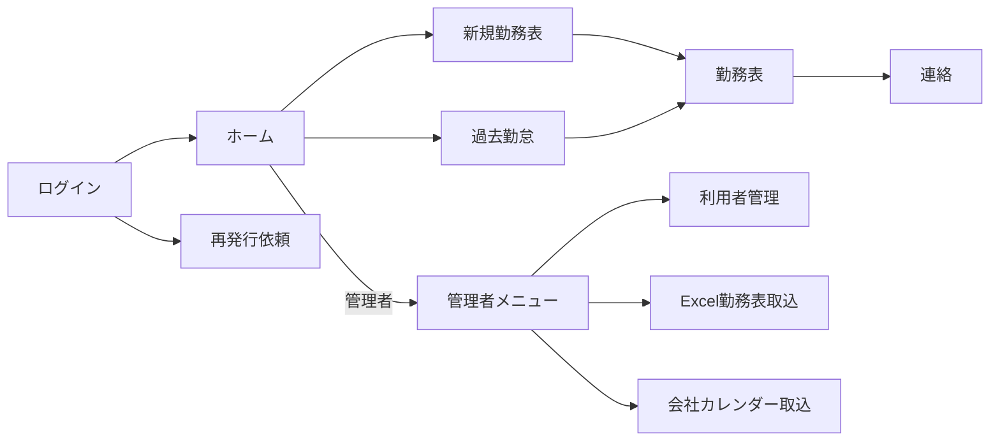

# 勤怠管理システム 外部設計書

## 1. 画面構成

| 画面 | 利用者 | 主な操作 |
|---|---|---|
| ログイン | 全員 | ログイン、認証エラー確認、再発行依頼 |
| ホーム | 全員 | 新規作成、過去参照、管理者メニューへの遷移 |
| 勤務表 | 全員 | 月次作成、日次入力、一括保存、削除、Excel出力 |
| 過去勤怠 | 全員 | 年月選択、参照、編集 |
| 連絡 | 本人 | Outlook下書き作成、Slack連絡 |
| 管理者メニュー | 管理者 | 利用者管理、社員検索、Excel取込、会社カレンダー取込 |
| 利用者管理 | 管理者 | 利用者作成、更新、仮パスワード再発行 |
| Excel勤務表取込 | 管理者 | 対象社員選択、ファイル・パスワード指定、警告確認 |
| 会社カレンダー取込 | 管理者 | PDF取込、休日プレビュー |
| パスワード変更 | 全員 | 現在・新パスワード入力 |

## 2. 画面遷移

## 3. 共通レイアウト

- ヘッダー左端にクエリロゴ、右端にログイン中のユーザーIDを表示する。
- メインコンテンツ左側に縦型メニューを固定する。
- 管理者メニューだけ黄色、その他メニューは白を基本とする。
- 画面幅が狭い場合、一般画面は1列へ再配置し、Excel形式の勤務表だけ横スクロールを許可する。
- エラーは文字化けさせず、対象入力欄の近くへ日本語で表示する。

## 4. 勤務表入出力

| 項目 | 入力・表示仕様 |
|---|---|
| 対象年月 | 2000年1月～2100年12月 |
| 所属・氏名・役職・コード | 社員マスターから自動表示 |
| 始業・終業 | `HH:mm`。4桁入力を自動変換 |
| 休憩 | `H:mm`。既定値`1:00` |
| 休暇種別 | AM半休、PM半休、有給休暇、特別休暇、慶弔休暇、振替休日、欠勤 |
| 業務内容 | 最大500文字 |
| システムNo. | 最大50文字 |
| WG | 参加、不参加、当月未開催 |
| Pマーク運用確認日 | 対象月の確認日 |

休日はグレーアウトし、平日の必須検証対象から除外する。保存は変更行をまとめて実行し、成功後に最新データを再表示する。

## 5. 外部向けAPI

| メソッド・パス | 権限 | 概要 |
|---|---|---|
| `GET /api/auth/session` | 公開 | 認証状態とCSRFトークン取得 |
| `POST /api/auth/login` | 公開 | フォームログイン |
| `POST /api/auth/credential-recovery` | 公開 | 再発行依頼 |
| `POST /api/auth/logout` | 認証済み | ログアウト |
| `PUT /api/auth/password` | 認証済み | 本人パスワード変更 |
| `GET /api/employees/me` | 認証済み | 本人社員情報 |
| `GET /api/timesheets/history` | 認証済み | 本人勤務表履歴 |
| `GET /api/timesheets/{year}/{month}` | 認証済み | 本人勤務表取得 |
| `POST /api/timesheets/{year}/{month}/initialize` | 認証済み | 月次勤務表作成・再初期化 |
| `PUT /api/timesheets/{year}/{month}/entries/{date}` | 認証済み | 日次更新 |
| `DELETE /api/timesheets/{year}/{month}` | 認証済み | 本人再認証付き論理削除 |
| `GET /api/timesheets/{year}/{month}/export.xlsx` | 認証済み | Excel出力 |
| `POST /api/timesheets/{year}/{month}/outlook-draft` | 認証済み | Outlook一度限りURL発行 |
| `GET /api/outlook-drafts/{token}.eml` | トークン | 未送信メール取得 |
| `/api/admin/**` | 管理者 | 社員・勤務表・取込管理 |

エラー応答は原則として`{"message":"日本語メッセージ"}`とし、認証なし401、権限不足403、入力不正400、対象なし404、競合409を使用する。

## 6. ファイル仕様

- Excel入力：`.xlsx`または`.xlsm`、10MB以下、シート名`勤務表`
- PDF入力：PDF署名を持つ10MB以下、1～50ページ、文字抽出可能
- Excel出力：`.xlsx`、保存済みDBデータから都度生成
- Outlook：`message/rfc822`の`.eml`、ExcelをMIME添付

## 7. 外部連携

- Outlookローカル連携は`query-attendance-outlook:`プロトコルを使用する。
- Outlookメールは宛先を自動決定せず、利用者が宛先を確認して送信する。
- Slack Webhookは`hooks.slack.com`または`hooks.slack-gov.com`のHTTPS URLだけを許可する。
- Microsoft GraphとSlackの秘密情報は環境変数から読み込み、画面・DB・ログへ出力しない。
