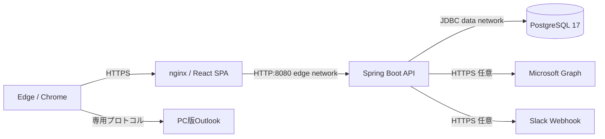

# 勤怠管理システム 内部設計書

## 1. システム構成

| 層 | 技術 |
|---|---|
| フロントエンド | React 19、TypeScript 6、Vite 8、nginx |
| バックエンド | Java 21、Spring Boot 4.1、Spring Security、JdbcClient |
| DB | PostgreSQL 17、Flyway |
| 帳票・取込 | Apache POI 5.5.1、PDFBox 3.0.8 |
| 実行基盤 | Docker Compose |

## 2. バックエンド構造

| パッケージ | 責務 |
|---|---|
| `auth` | ログイン検証、ロック、パスワードポリシー、有効期限、再発行 |
| `employee` | 本人社員情報、管理者による利用者管理・検索 |
| `timesheet` | 月次生成、日次計算、集計、履歴、削除、Excel出力 |
| `importer` | Excel勤務表の検証・解析・登録 |
| `calendar` | 会社カレンダーPDF解析・休日登録 |
| `integration` | Outlook、Microsoft Graph、Slack |
| `common` | 例外応答、監査ログ |
| `config` | 認証・認可、CSRF、セキュリティヘッダー |

Controllerは入力形式と認証主体を確定し、業務判断はService、SQLはRepositoryまたは用途を限定したJdbcClientへ置く。更新処理と取込処理はトランザクション境界内で実行する。

## 3. データモデル

| テーブル | 用途 | 主要制約 |
|---|---|---|
| `users` | 認証情報 | PK username、BCrypt、ロック、有効期限 |
| `authorities` | 権限 | username+authority一意、ROLE_USER／ROLE_MANAGER／ROLE_ADMIN |
| `employees` | 社員マスター | username、社員コード一意 |
| `timesheets` | 月次勤務表 | 有効データは社員・年月一意、論理削除 |
| `daily_entries` | 日次明細 | 勤務表・日付一意 |
| `company_holidays` | 会社休日 | 日付PK |
| `company_calendar_imports` | PDF取込履歴 | SHA-256、操作者 |
| `excel_timesheet_imports` | Excel取込履歴 | SHA-256、対象、件数、操作者 |
| `credential_recovery_requests` | 再発行依頼 | 社員ごとのPENDING一意 |
| `audit_logs` | 監査ログ | 操作者、操作、対象、日時 |

勤務表削除は`deleted_at`と`deleted_by`を設定する。通常検索は`deleted_at IS NULL`だけを返す。

## 4. 勤務時間計算

1. 始業を15分単位で切り上げる。
2. 終業を15分単位で切り捨てる。
3. 終業が始業より前の場合は翌日として扱う。
4. 休憩を15分単位で切り上げる。
5. `終業 - 始業 - 休憩`を0未満にならないよう計算する。
6. 平日と休日の時間を別集計する。
7. 半休は所定時間の0.5日、全日休暇は1日として所定日数へ反映する。

計算は`WorkTimeCalculator`、月次集計は`MonthlyAggregator`へ分離し、境界値を単体テストする。

## 5. 認証・認可設計

- セッションCookie：`ATTENDANCE_SESSION`、HttpOnly、SameSite=Strict、本番Secure
- CSRF：Cookieトークンと`X-XSRF-TOKEN`ヘッダーの二重送信
- セッション固定攻撃：ログイン時にセッションIDを変更
- 同時セッション：ユーザーごとに最大1件
- パスワード：BCrypt cost 12、12～128文字、弱い値を拒否
- ロック：5回失敗で15分
- 役職者API：`/api/management/**`を`ROLE_MANAGER`または`ROLE_ADMIN`に限定し、削除は`ROLE_ADMIN`だけに限定
- 管理者API：`/api/admin/**`とExcel取込APIを`ROLE_ADMIN`に限定
- 仮パスワード・期限切れ：許可API以外をFilterで遮断

## 6. Web・ファイルセキュリティ

- CSP、HSTS、X-Content-Type-Options、X-Frame-Options、Referrer-Policy、Permissions-Policyを設定する。
- Reactの標準エスケープを使用し、`dangerouslySetInnerHTML`を使用しない。
- SQLはJdbcClientの名前付きパラメーターを使用し、文字列連結しない。
- アップロードはSpringの10MB上限に加え、業務サービスで拡張子、署名、ページ数、内容を検証する。
- 取込ファイルとExcelパスワードは処理中のメモリだけで扱い、恒久保存しない。
- Outlookトークンは256ビット乱数、2分、一度限り、利用者ごとに未使用1件とする。
- nginxはOutlookトークンを含むURLをアクセスログへ残さない。

## 7. コンテナ・ネットワーク設計

- フロントエンドは`edge`ネットワーク、DBは外部接続不能な`data`ネットワークへ配置する。
- バックエンドだけを両ネットワークへ接続し、フロントエンドからDBへ直接到達させない。
- バックエンドとフロントエンドは非rootユーザーで実行する。
- `no-new-privileges`とLinux capability全削除を設定する。
- PostgreSQLはホストへポート公開せず、SCRAM-SHA-256を使用する。

## 8. ログ・監査

パスワード、セッションID、CSRFトークン、Outlookトークン、Webhook URL、個人情報を通常ログへ出力しない。監査ログには業務上必要な操作者、操作名、対象種別、対象ID、補足だけを保存する。

## 9. 同時更新

`timesheets`と`daily_entries`には`version`列があり更新ごとに加算するが、現行APIは読込時バージョンとの比較を行っていない。本番で同一勤務表を複数端末から同時編集する運用へ拡大する前に、期待バージョンを受け取り条件付き更新する楽観ロックを追加する。

## 10. DB移行

Flywayの`V1`～`V7`を起動時に順次適用する。適用済みマイグレーションを編集せず、新しい変更は次番号のSQLとして追加する。破壊的変更はバックアップ、復元確認、ロールバック手順を用意してから実施する。
